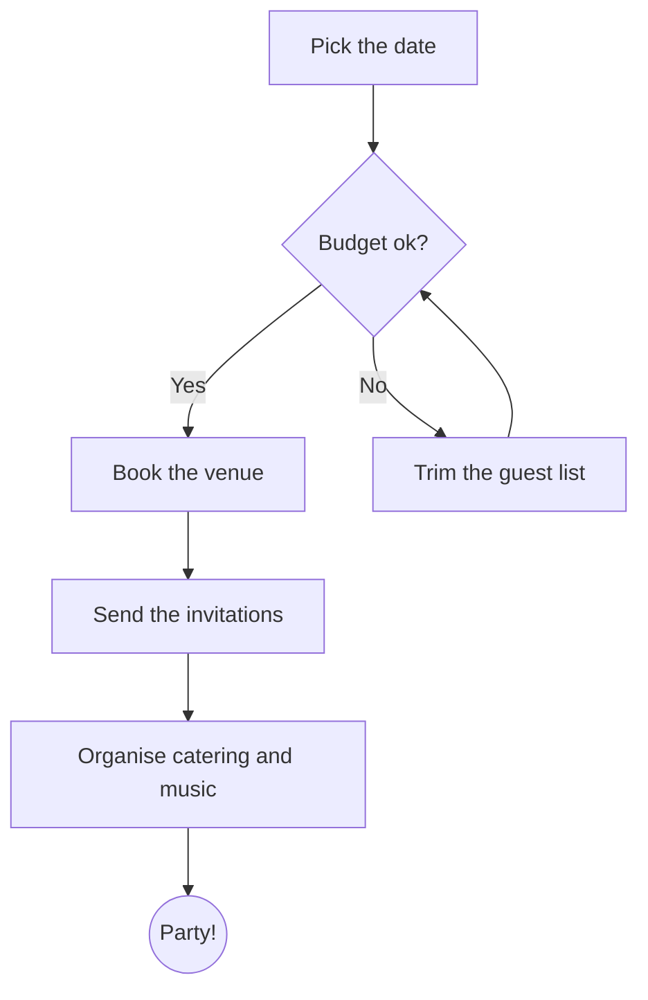

# Throwing a Party, Step by Step

```mermaid
flowchart TD
    A[Pick the date] --> B{Budget ok?}
    B -- Yes --> C[Book the venue]
    B -- No --> D[Trim the guest list]
    D --> B
    C --> E[Send the invitations]
    E --> F[Organise catering and music]
    F --> G((Party!))
```

A real example: the [[Léa's 10th Birthday]] project.
